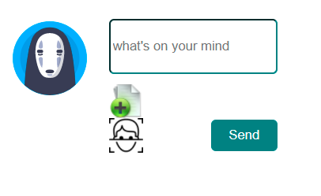
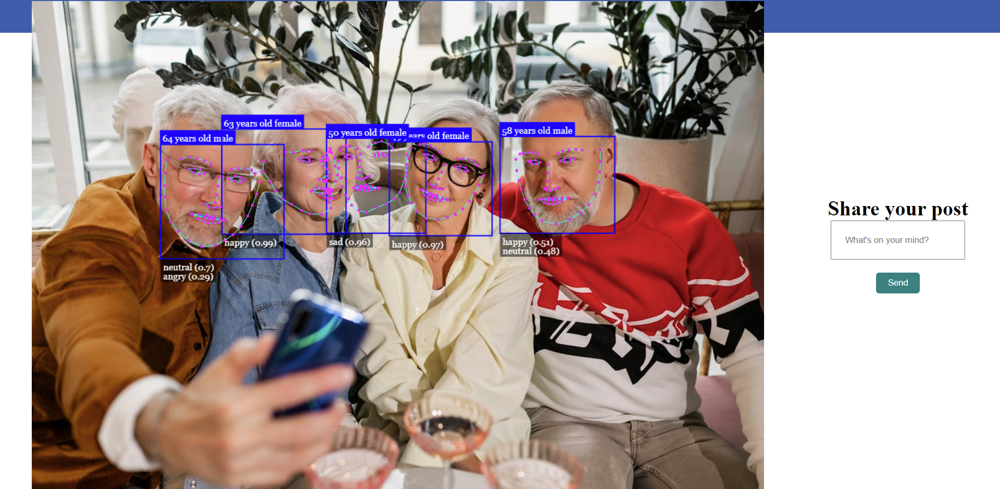
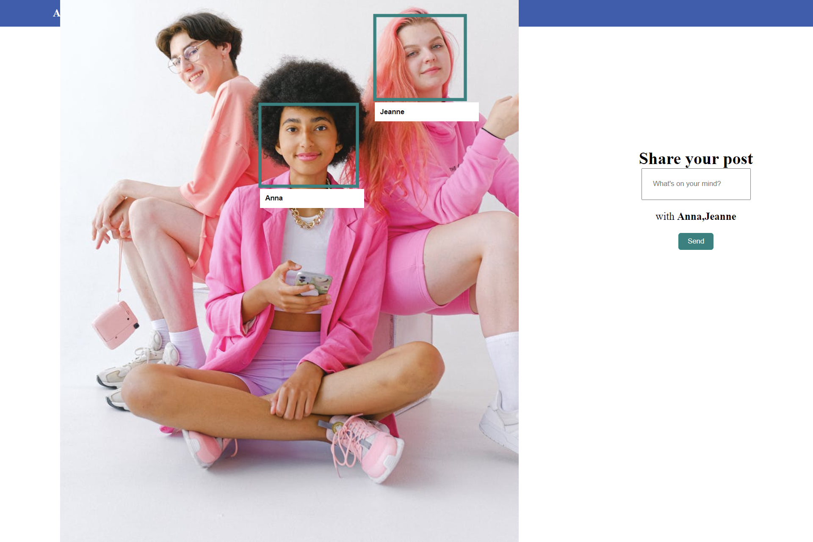

# React Face AI detection with Tag App

## Description

A React App build Using a free AI library **[FaceAI](https://github.com/justadudewhohacks/face-api.js)** to detect faces landmarks, face emotions and expressions, age, gender and many more. It takes an image and draw all the outputed data on the canvas.
It's a small use case that can be implimented in bigger projects and make use of the out sourcing data for diffrent and multiple case studies.

## Face Api for React `npm install face-api.js`

## Load Models

After implimenting the [Face API Models](https://github.com/justadudewhohacks/face-api.js/weights) in you public file under the root path.
Make use of them by loading them all in your React component:

````javascript
     const loadModels = () => {
        Promise.all([
          faceapi.nets.tinyFaceDetector.loadFromUri('/models'),
          faceapi.nets.faceLandmark68Net.loadFromUri('/models'),
          faceapi.nets.faceRecognitionNet.loadFromUri('/models'),
          faceapi.nets.faceExpressionNet.loadFromUri('/models'),
          faceapi.nets.ageGenderNet.loadFromUri('/models'),
          
        ]).then(handleImage)
          .catch(e=>console.log(e));
      };
````

## ImgRef & CanvasRef

Create an ImgRef and CanvasRef using React Hook `useRef()` to access face api box.
```html

<canvas ef={canvasRef} height={height} width={width} />
```

## Handle Detection

````javascript
    const detections = await faceapi.detectAllFaces(
      imgRef.current, 
      new faceapi.TinyFaceDetectorOptions()
    ).withFaceLandmarks().withFaceExpressions().withAgeAndGender().withFaceDescriptors();
    
    canvasRef.current.innerHTML = faceapi.createCanvasFromMedia(imgRef.current);
     faceapi.matchDimensions(canvasRef.current, {
       width,
       height,
     });
````

## Match Dimensions

Resize your canvas height and weight to match the image dimensions, so that the frames underline the faces:

````javascript
    const resized = faceapi.resizeResults(detections, {
        width,
        height,
     });
````

### Draw Face Exprssions

````javascript
faceapi.draw.drawFaceExpressions(canvasRef.current, resized);
````

### Draw Face Landmarks

````javascript
faceapi.draw.drawFaceLandmarks(canvasRef.current, resized);
````

### Draw Age & Gender

````javascript
resized.forEach( detection => {
        const box = detection.detection.box
        const drawBox = new faceapi.draw.DrawBox(box, { label: Math.round(detection.age) + " years old " + detection.gender })
        drawBox.draw(canvasRef.current)
});

````

# Overview

## Home Page



## Face Detection



## Tag a Recognized Person



# Credits [Face-Api.js](https://github.com/justadudewhohacks/face-api.js)
